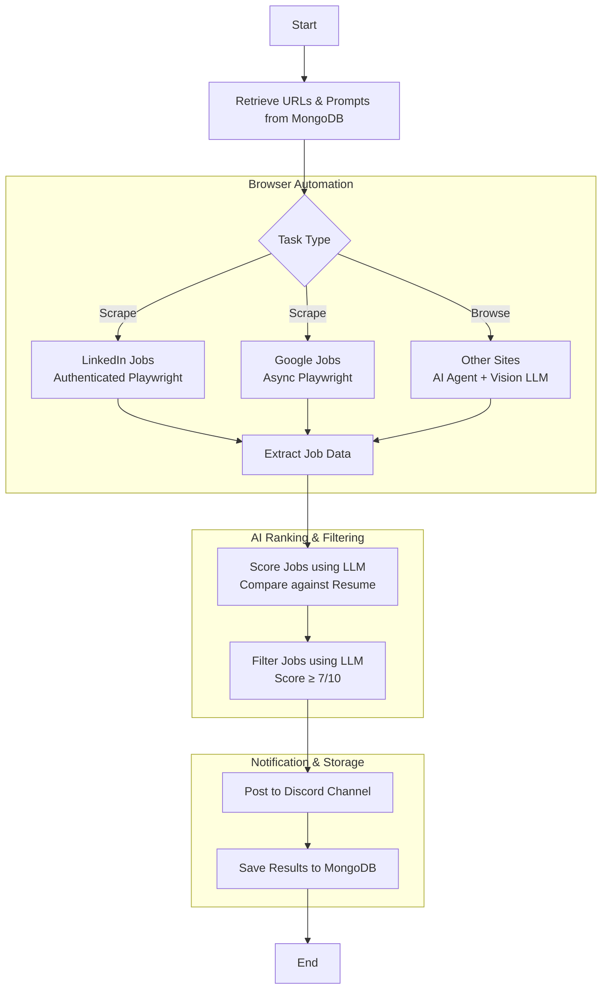

# LLM Browser
## About
The LLM Browser is a Python project that uses Large Language Models (LLMs) to 
autonomously browse the internet. It leverages tools like Playwright for 
browser automation and web scraping, and LangChain for LLM integration to 
perform tasks such as content summarization and rating.

> [!WARNING]
> I use this for personal tasks - things might break! 

## How It Works
### Technology Stack
This solution leverages several key technologies to autonomously browse and 
analyze job postings:

**Playwright:** Web automation framework for scraping job data from LinkedIn 
and Google Jobs
**browser-use:** AI agent library that enables LLM-driven web browsing
**LangChain:** Framework for integrating multiple LLM providers (OpenAI, 
Anthropic, Google Gemini)
**MongoDB:** Database for storing job data, prompts, and results
**Discord Webhooks:** For posting filtered job results to channels
**LLMs:** Utilizes OpenAI, Anthropic, Google Gemini, and Ollama for processing 
and generating responses

### Process Flow


### Detailed Steps
1. **Data Retrieval**: The system fetches URLs, prompts, and resume data from MongoDB collections

2. **Browser Automation**: 
   - **LinkedIn**: Uses authenticated Playwright sessions to scrape job listings with pagination
   - **Google Jobs**: Employs async Playwright to extract job details and descriptions
   - **Other Sites**: Leverages browser-use with Gemini vision models for AI-driven browsing

3. **AI Ranking & Filtering**: 
   - **Job Analysis**: Each extracted job is analyzed using LLM models that compare job requirements against a stored resume and scored out of 10 based on relevance.
   - **Filtering**: High-scoring roles (7+) are selected to proceed.

4. **Notification**: Filtered results are automatically posted to Discord channels using webhooks

5. **Storage**: All results and metadata are saved to MongoDB for tracking and analysis

The system runs both synchronous (LinkedIn) and asynchronous (Google, other sites) browser instances to optimize performance and handle different site requirements.

## Features
1. **Autonomous Web Browsing:** Uses an LLM agent to interact with web pages.
1. **Web Scraping:** Extracts specific data from web pages, including handling dynamic content and CAPTCHAs.
1. **LLM Querying:** Integrates with various LLMs (OpenAI, Anthropic, Google Gemini, Ollama) to process scraped data and generate responses.
1. **Task Management:** Defines and executes tasks such as browsing and scraping based on configurations.
1. **Data Handling:** Uses MongoDB to store prompts, context, and results.
1. **Reporting:** Posts LLM-generated responses to platforms like Discord using webhooks.

## Setup and Installation
1. Clone this repository.
2. Prerequisites:
    - Python 3.11
    - MongoDB
3. Create a Python virtual environment and activate it:
```bash
python -m venv venv
source venv/bin/activate    # Unix/Linux
venv\Scripts\activate       # Windows
```
1. Install the required packages:
```bash
pip install -r requirements.txt
```
1. Configuration:
    - Create a `.env` file in the root directory and set the required environment variables (see `.env.example`).
    - Set up MongoDB and create a database named `llm_browser`.
    - Create collections for `prompts`, `context`, and `results` in the `llm_browser` database.
2. Run `main.py` to start the application.

## Demo
In the video below, the model was tasked with adding grocery items to cart, and checking out.

[](https://www.youtube.com/watch?v=L2Ya9PYNns8)

## Adding a Prompt
Use mongo-express to add a prompt. 

Alternative, you can use the terminal.

```bash
use llm_browser

db.prompts.insertOne( { 
    task: "scrape", 
    title: "Prompt Title",
    url: "url_to_scrape",
    prompt: "This is the prompt and return to me the results as a \
    markdown:\n\n \
    result format: # <title> \n <entity> \n <summary>"
} )
```

## Running Tests
To run all tests:
```bash
pytest -vs
```

To run a specific test case:
```bash
pytest -vs tests/test_scrapers.py::test_fetch_linkedin
```